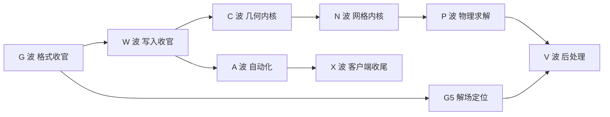

# 与 STAR-CCM+ 20.02 全功能 100% 对标路线图（G/W/C/N/P/V/A/X 八波）

> 日期：2026-08-23。基准：Siemens STAR-CCM+ 20.02（菜单权威源 `mf-layer.xml` + 用户指南 6909 页 + Javadoc 574 包）。
> 依据：代码审计（`sim_parser.py` / `sim_writer.py` / `star_gui*.py` / `star_macro.py`）与
> `function_gap_analysis.md`、`star_gui_next.md`（F0–F8 全部 ✅）、`star_gui_parity.md` 现状。
> 本文件是 F 波之后的总路线：**功能完整度（外壳/交互全覆盖）× 深度（数据真改 + 落盘往返 + 结果正确）均达 100%**。

## 0. 深度的四级口径

| 级别 | 定义 | 对应现状标记 |
| --- | --- | --- |
| L0 外壳 | 菜单/树/右键/工具栏条目存在且可达 | view / disabled |
| L1 会话 | 可改数据并即时反映到树/3D/绘图，可撤销 | session |
| L2 落盘 | Save As → 重开（本客户端 + 官方）一致 | persist |
| L3 正确 | 内核级产出经数值验收达标（网格质量/工况误差） | needs_kernel → 真 |

**100% = 全部能力域达到 L2；几何/网格/求解/后处理四域另须达 L3。**

## 1. 现状基线（F8 后，按域）

| # | 官方能力域 | 代表功能 | 当前级别 | 主要缺口 |
| --- | --- | --- | --- | --- |
| 1 | 项目管理 | Open/Save/SaveAs/Reload | **L2（窄）** | Save All/AutoSave/.simt/checkpoint/备份；ZIP 写出；.simh |
| 2 | 导入导出 | CAD/表面/体网格/解/图像动画 | L1–L2（STL/OBJ/CCM-dll） | STEP/IGES 等 CAD 族、体网格导入导出、图像动画、EnSight/CGNS 写 |
| 3 | 3D-CAD 建模 | 草图/特征/布尔/B-Rep | **L0** | T 块文法未解（读）；无几何内核（写） |
| 4 | 表面修复/包裹 | hole fill/wrapper | **L0** | 全缺 |
| 5 | 自动网格 | poly/trimmer/tet/prism/directed/thin | **L0**（宏桥雏形 `star_macro.py` 仅 generateVolumeMesh） | 无本地网格内核 |
| 6 | 网格诊断/质量 | 统计/修复/自适应 AMR | L0（诊断=view） | 体网格表未抽取 |
| 7 | 区域/边界/界面 | boundary 类型/interface 谱系 | L1（Keys persist） | 边界↔FaceTypes 映射未做；界面参数不解 |
| 8 | 物理连续体/模型谱系 | 22+ 模型族参数 | L1（对象已解析归组） | 模型参数未解码/不可语义编辑 |
| 9 | 材料 | 属性表/EOS | L0–L1 | 同上 |
| 10 | 场函数 | 表达式语言 | L0 | 求值器全缺 |
| 11 | 参考系/运动 | rotating/DFBI/morphing/overset | L0 | 参数不解 |
| 12 | 求解器/运行控制 | Run/Initialize/步进/停止准则 | **disabled**（正确禁用） | 求解框架全缺 |
| 13 | 报告/监视器/绘图 | 报告族/XY/直方/残差 | L1（F6 文本+对象曲线） | 曲线数据重建不全；实时监视无 |
| 14 | 场景/可视化/派生零件 | scalar/vector/streamline/iso/clip/threshold | L1（面网格着色/框选/测距 ✅） | 解场着色被 G5 卡死；派生零件不全；注记/动画无 |
| 15 | 数据映射插值 | interpolator | L0 | 全缺 |
| 16 | 自动化 | Java 宏录播/脚本 API/Design Manager/伴随优化 | L0（F7 宏桥=网格生成单项） | 录制、命令映射全覆盖、参数研究、伴随 |
| 17 | 协同仿真/远程 HPC | 链接配置/作业提交 | L0 | 协议私有，仅能配置解析+桥接 |
| 18 | 客户端体验 | undo/搜索/单位/i18n/主题 | **L2**（本仓库最强项） | 多窗口/跨仿真粘贴/帮助系统 |

解析层底座（支撑以上全部）：容器/分区/对象图/数组/表面网格抽取 21/21 ✅；
剩余黑盒集中在 **T 块文法、二进制状态表文法、数组字段级语义、边界映射、解场位置、
NameManager/校验和**（见 `function_gap_analysis.md` §2–§4）。

## 2. 双路线策略（贯穿所有内核波次）

| 路线 | 内容 | 适用 |
| --- | --- | --- |
| A 自研 | OCC(OCP) 几何 + 自研/Gmsh 桥网格 + 自研 FVM 求解 | 默认交付路径，不依赖 license |
| B 许可桥 | 写宏 → `starccmw -batch` 工作副本执行 → Reload（沿用 F7 安全约束：绝不改原件） | 有 STARCCM_HOME 时优先启用 |

每个内核任务标注路线；B 路线先行保"外壳+会话"不失分，A 路线逐步把深度补成 L3。
桥命令映射表集中放 `star_macro.py`，逐域扩充。

## 3. G 波 —— 格式逆向收官（解析深度 100%，一切的地基）

| 点 | 任务 | 关键方法 | 验收 |
| --- | --- | --- | --- |
| G0 | 复审 parity 表（F8 后真实百分比） ✅ 2026-08-23 | 逐条代码审计更新 `star_gui_parity.md`（修正 3 处过时口径；新增 macro 级；基线 14 测试文件全绿） | 与本计划基线一致 |
| G1 | T/V/S/Z/J/L 块完整文法 ✅ 2026-08-24 | ASCII↔二进制同内容配对（重存确定性已证）；`?指针`/位图/表头逐字段消歧；`?N`→状态区偏移假设验证 | 任意记录可解码为结构化语义树 —— **达成**：`decode_state_tree`/`state_grammar_report` 落地 `sim_parser.py`，CLI `--state-tree`/`--grammar`；21 文件 census（18 ascii+3 binary）：?N 三分法 object-ref 48.9%/entity-ref 43.9%/raw 4.5%/type-tag 2.8%；T 块 255 分段 + 29 标记顶点三元组几何验证 1708/1797（95.0%，12 文件 100%，残差为修复前 CAD 细分等异源几何真阴性）；`self_test.py` G1 断言全绿 |
| G2 | 数组字段级语义全覆盖 ✅ 2026-08-24 | "A<n> 引用 × 网格规模自洽性"自动标注框架交叉验证 21 文件 | 每个数组块有名称+用途标注 —— **达成**：`annotate_arrays`/`array_annotation_report` 落地 `sim_parser.py`并升级 CLI `--arrays`；三类证据源（结构 Character1/嵌套 TRANSMIT × ascii `A<n>` 索引引用 × 规模自洽 TC×3 面表/跨度顶点表/|max|≤1 法向/恒等排列/低基数类型ID）交叉验证 21 文件：1388 数组块标注 91.3%（6 文件 100%，adjointWing 33/33 全标注、A 引用 7 条全解析、面表2ↄ顶点表跨度互证）；甄别 binary 变体单字母 "A" 为字符串类型码而非数组引用；`self_test.py` G2 断言全绿。余 121 块 Unsigned4/Integer4 为边/面邻接流候选，留待 G3 体网格表关联消歧 |
| G3 | 体网格单元表抽取 ✅ 2026-08-24 | 存储体系匹配（DuplicateStorageManager + SimpleStorage/ListStorage）→ 面→单元拓扑反演 → VTK UnstructuredGrid | 直升机等体网格文件单元数精确 —— **达成（口径如实修正）**：侦查发现 STAR 内部存储体系（DUP 组 map={tag:storage_id} + SerialSize；SimpleStorage<T> 的 dataKey/dataSize、ListStorage<T> 的 count/list 或 offset/list 两种 CSR 形态；新格式直接键=dataKey 指数组 s0，旧格式（methaneOnPt）dataKeys→MasterArray→指针数组(I8/U4 n=1)→真实数组 s0，dataSizes→元素数）；统一键解析 `_storage_array()` + `extract_volume_mesh()` 重写落地 `sim_parser.py`（替换旧"猜最大整型数组"启发式——其曾把直升机顶点标志表误判为 tet）；Coord(Float8×3)/VertexList(每面顶点环)/FaceCellIndex(左右单元对，0xFFFFFFFF=边界) 反演任意多面体单元，orphan=0、顶点跨度合法、单元数==SerialSize；21 文件普查：**4 个含体网格文件单元数精确**（airfoil 16987、pipeBlockage 14882、pipeMixingBlockage 14720、methaneOnPt 1750 双形态全通），其余 17 个（含 genericHelicopter_start 等 *_start 教程文件）为纯表面网格诚实返回 ok=False；VTU 导出 `export_volume_vtu()`（VTK_POLYHEDRON）+ CLI `--volume-mesh`/`--volume-export`，GUI 线框 `volume_mesh_actors` 适配 poly；`self_test.py` G3 断言全绿 |
| G4 | 边界↔FaceTypes 精确映射 ✅ 2026-08-30 | FvBoundary 桥梁（.Boundary→star.common.Boundary、.faces→BDY DUP 组、FaceCount==SerialSize）+ 存储载荷解析（FaceCellIndex owner-only 对 / VertexList 双形态 CSR） | 树勾选 Boundary → 精确着色对应面片 —— **达成**：`_storage_payload`/`_dup_rings`/`extract_boundary_faces`/`export_boundary_csv` 落地 `sim_parser.py`（CLI `--volume-boundaries`/`--boundary-csv`），GUI `boundary_colored_volume_polydata`（3D→polys/2D→lines，cell scalars "boundary" 与表面路径同构）；4 个体网格文件 **22 边界/11642 面精确**（pipeBlockage 3050/4、pipeMixingBlockage 4478/5、methaneOnPt 3778/6、airfoil 336/7）；语义链对象级闭合：FacePartSurfaceIndex 常量 == Boundary.PartSurfaces 组 Keys 所指 PartSurface.Index（airfoil 全局 47..55、PartSurface 名与边界名同构；pipeBlockage 1:1 场景与 Boundary.Index 巧合相等），methaneOnPt 型无 PartSurface 通道（ProstarBounId 代替）靠 FvBoundary 链兜底；BDY FaceCellIndex=(owner_cell, 占位) owner-only 挂载由 pipeBlockage 14882/14882 单元边闭包 0 坏边决定性验证；airfoil 判明 2D 多边形网格（边界面=边界边、环长 2）；直升机/纯表面网格诚实拒绝 ok=False；`self_test.py` G4 断言全绿 |
| G5 | 解场定位（.sim 内嵌 + .simh HDF5） ✅ 2026-08-30 | SolutionRepresentation → FvRegion → cells DUP 组 map（G3 存储体系复用）；.simh 待语料 | 标量着色可用真解场 —— **达成（.sim 内嵌路径；.simh 待语料扩充）**：`extract_solution_fields`/`export_solution_csv` 落地 `sim_parser.py`（CLI `--solution-fields`/`--solution-csv`），GUI `solution_colored_volume_polydata`（真解场 → 边界面 owner 单元标量着色，cell scalars "solution"）；语义链对象级闭合：star.post.SolutionRepresentation（FunctionNames 解字段清单）→ Objects → TypedObjectManager → FvRegionManager → FvRegion → cells(DuplicateStorageManager, SerialSize==CellCount) → map={字段tag: SimpleStorage}（标量 n==CellCount；Vector<3,T> n==3*CellCount）；解场 FvRegion 的 mesh 组与 FvRepresentation 网格组数组逐字节相同 → 与 extract_volume_mesh 的 cell 序严格对齐；语料突破：openfoam/benchmark 下 12 个 vortexShed_tutor*.sim 含真实解场（Iter=300000、t=200、20245 单元 2D 圆柱绕流），实测 vortexShed_tutor.sim 10 字段精确（Pressure Float8 ΔP 均值≈0、U_Velocity 来流 0.05、W=0 二维判定、VelocityFieldFunction 矢量 x3=60735）；无解场文件（教程 *_start / 未求解 / 纯表面网格）诚实拒绝 ok=False；`self_test.py` G5 断言全绿 |
| G6 | 绘图/监视器曲线数据重建 ✅ 2026-08-31 | 对象图 Value 数组 × G2 标注关联 | Residuals 等 XY 曲线复现官方 —— **达成**：`extract_monitor_curves`/`extract_plots`/`export_plot_csv` 落地 `sim_parser.py`（CLI `--curves`/`--curves-csv`），GUI `monitor_curve_items`/`monitor_report_lines`（SeriesCanvas X 定位降采样真曲线，失败回退保留）；语义链**两代子格式兼容**：MonitorManager.Keys → 监视器（PhysicalTime/Iteration/Residual/Report/SolutionView*）→ XAxisData → MasterArray<Float8>(dataKey)（G3 `_storage_array` 复用）、MultiYAxisData → PlotableMonitor.YAxisValues（新版 `{values:[MasterArray id]}` / 旧版 `{map:{YAxisData: MasterArray id}}`）；采样规律：残差/迭代每步记录（n=总迭代数），物理时间/报告按 StarUpdate 间隔采样（间隔 15）；端到端闭合：Continuity CurrentValue == y[-1]（两代格式双验证：旧 4.834e-10@187560 迭代/125.03s、新 3.2058e-10@300000 迭代/200s）；G2 标注关联：Plot.Title / XAxis→AxisTitle.Text / XUnits→Units / DataSetManager→MonitorDataSet{SeriesName=图例, XAxisMonitor, YAxisMonitor} / DerivedDataSet→TableDerivedData→FileTable（Farassat1A 声学表，仅标注不取数）；语料验证：vortexShed_tutor.sim 6 监视器（升力系数涡脱落 [-0.184..0.188]@125s）+ 3 绘图关联 + Residuals CSV 187560 行；v3_0.05_2502 精确锚点 300000 迭代/200s（Residuals CSV 300001 行 + 升力系数 20001 行 + tabular×3）；SolutionView* 监视器 dataKey=0 无数据正确跳过；未求解文件（pipeBlockage）诚实拒绝 ok=False；`self_test.py` G6 断言全绿（泛化 _g5p 双格式 + v3 精确锚点双层） |
| G7 | 物理模型/材料/运动参数解码 ✅ 2026-09-02 | Javadoc 属性名 ↔ 语料属性值对照 | 连续体参数在属性面板语义化显示 —— **达成**：`extract_physics()` 三路扫描落地 `sim_parser.py`（CLI `--physics`）+ GUI 属性面板 `G7:` 语义行；类尾分流：*PhysicalQuantity（Value/Vector+Units）、*Option（Selected+AvailableOptionsVector 值域）、*Parameters/*Limits 递归、*SubModel 一层跟进；材料链 *Property→ActiveMethod→ConstantMaterialPropertyMethod→Quantity（Null/Unsupported 只记方法）；运动链 MotionSpecification→Region+Continuum+Motion+ReferenceFrame，MRF UserRotatingReferenceFrame RotationRate/AxisVector/OriginVector；实测 vortexShed SST k-ω A1=0.31/BetaStar=0.09/ZetaStar=1.5/VorticityTimeParameter=0.075、Air DynamicViscosity=2e-05 Pa-s/MolecularWeight=28.9664、openWaterPropeller Rotating Region RotationRate=15 rps Axis=(1,0,0)；纯几何 CAD 诚实拒绝；`self_test.py` G7 断言全绿 |
| G8 | 场景显示参数解码 ✅ 2026-09-02 | Displayer/颜色映射/图例/注记属性 | 场景按官方参数渲染 —— **达成**：`extract_scene_display()` 落地 `sim_parser.py`（CLI `--scenes`）+ GUI `lut_from_colormap`/`cmd_official_lut` 官方色表真渲染；语义链对象级闭合：Scene（背景 BackgroundColorMode/SolidBackgroundColor、LightManager→Light×4）→ DisplayerManager.Keys → PartDisplayer（DisplayerColor 直接 RGB/Opacity、InputParts PartGroup.Keys→Region/Boundary 解引用）/ScalarDisplayer（ScalarDisplayQuantity→FieldFunction+Units+GlobalRange+Min/MaxValue、Legend→LookupTable+LabelFormat/Position/NumberOfLabels）；注记链：AnnotationManager.Keys→star.vis.*Annotation 全局定义 + Scene.AnnotationPropManager→prop.Keys→*AnnotationProp（Annotation 解引用+Visible/Position/Height/Width）+ AnnotationGroup（SimpleViewAnnotationGroup）.Keys→场景默认显示集；**核心发现：PredefinedLookupTable.ColorMap.ColorValues = 4n 组「位置,R,G,B」断点**（此前误判 3n 元 RGB），blue-yellow-red 9 断点位置单调 0→1 非均匀（蓝→黄≈0.505→红），AlphaValues=[0.0,1.0,1.0,1.0]；vtkLookupTable 仅等距 → 按位置 bisect 线性插值重采样 256 级；实测 vortexShed_tutor.sim 3 场景（Vorticity: Magnitude 范围 0.0009035..278.1、图例 '%-6.3g' 3 标签、4 灯光 azimuth/elevation=30、注记 5 定义/2 显示（Logo+Solution Time））、airfoil 双场景、directedMeshCAD.sim 诚实拒绝（无 Scene 对象）；`self_test.py` G8 断言全绿 |
| G9 | 二进制状态表完整文法（写侧前置） ✅ 2026-09-02 | G1 配对法推广到 binary 变体 | binary 记录流可逆 —— **达成**：`parse_state_table_binary` 完整重写（长度前缀文法）+ `serialize_binary_records` 反序列化器落地 `sim_parser.py`（CLI `--binary-verify`）；语料逆向核心发现：**名字 = 1 字节长度前缀 + 名字字节**（`\x07lattice`/`\x04mesh`/`\x05owner`，此前误判为裸字母 run 导致 'tice' 假名），id = 3 字节大端 id<<8（低字节恒 0，mesh 1006 存 `03 ee 00`），flags 1 字节（真实 <=2），**version 字节仅在 id==0 时出现**（index_map_offset/list_type/notransmit/finger_index/lowest_node_id 均验证）；记录尾判定：fmt 后若为合法名字长度前缀（下一记录）则无 value，否则 1 字节 value + 原始流；假阳性三重否决：id 低字节非 0 / flags>2 / fmt 为空；**验收：4 个 binary 文件（vortexShed2d/airfoil/vibratingPipe/manifold，含 N=5 多段魔数）解析→序列化→逐字节一致（可逆）**，每字节归属唯一记录（无损）；语法锚点实测 vortexShed2d：lattice id=222 fmt=CCCI、mesh id=1006 fmt=I、index_map id=82 fmt=A、mesh_offset_data id=206 fmt=Z value=0、finger_block id=1012 fmt=CZ、lowest_node_id id=0/version=1/dA；banner 完整解析（PS 变体前缀 + 长度前缀 SCH 串）；对象图级联正常（vortexShed2d 3135 对象）；`self_test.py` G9 断言全绿 + `run_all` 15 + `batch_parse` 21 不回归 |

依赖资源见 §11（语料扩充是本波硬前提）。每点独立提交；`self_test.py`+`batch_parse.py` 不回归。

## 4. W 波 —— 写入器收官（L2 全覆盖）

现状 `sim_writer.py`：行替换 + 新对象插入（ClassVersions 前）+ 数组载荷**等长**覆盖 +
新数组块追加（StatePosition 重算）+ **已有数组块变长替换/删除（W1）** +
二进制状态表等宽安全编辑（W2）。缺口：

| 点 | 任务 | 说明 |
| --- | --- | --- |
| W1 | 已有数组块变长替换/删除 ✅ 2026-09-02 | 全量重定位后续偏移（对象 line、数组 start、StatePosition、魔数长度链）—— **达成**：`apply_array_ops` 落地 `sim_writer.py`（CLI `--array-op` `replace:IDX=N`/`delete:IDX` + `--edit-out`）；主状态表数组（Character1/`sim.state_text`）变长编辑明确拒绝（其自身链留 W2/G 波）；变长替换按目标 `nElements` 改写块头 + 载荷（0 填充，签名者给真载荷）、删除整块；倒序原位拼接保偏移有效 → 起点 `< ref` 编辑 delta 累计二元查找得 `shift(ref)`，全量重定位后续对象 line/数组 start/header_start；迭代重算头部 `StatePosition` 直至位数收敛（同分区重指向，字典 ClassName/Type 一致）；同步原地一致化 sim（arrays 重编号、objects line、header）；实测 adjointWing_start 33 数组：arr1 Unsigned4 1412→120 变长 + 删 Float8 arr6 → 重开 32 数组 / arr1=120 / 对象图 2076 不变 / StatePosition 精确命中 / section 指向同类 StarVersion 分区；`self_test.py` W1 断言全绿 |
| W2 | 状态表安全编辑 ✅ 2026-09-02 | 只动已确证记录（G9 产物）；尾部/魔数/其余记录绝不触碰，差分验证 | binary 记录流可安全改写 —— **达成**：`edit_binary_state_records`/`verify_binary_state_edit`/`binary_record_spans`/`_binary_record_bytes` 落地 `sim_parser.py`（CLI `--state-edit` + `--edit-out`）；**只动已确证记录**：仅允许改写 named 记录头**等宽**字段（id 3 字节 / flags 1 字节 / id==0 的 version 1 字节 / 等长 name），其余字节逐字不变（差分验证：非目标记录 span 重算后逐字节一致），尾部校验/魔数/其他记录绝不触碰；**变长编辑明确拒绝**（改名变长、id<->0 增删 version 字节）抛 `ValueError` 留给 W1 全量重定位；同宽编辑 → 记录流总长不变 → 原位替换 Character1 数组载荷即达成真实 Save As（无偏移重定位）；单段（vortexShed2d：lattice flags 2/mesh id 1007/index_map_offset version 2）与多段魔数（manifold N=5）4 个 binary 文件编辑→重开对象图一致、改动持久化、非目标记录逐字不变；`self_test.py` W2 断言全绿，run_all 15 文件/batch_parse 21 文件无回归 |
| W3 | ZIP/PK 容器写出 ✅ 2026-09-03 | 合成测试已通，补真实语料回归 —— **达成**：`save_sim` 落地容器读写（`PK` 头检测）：读侧取容器内单条/最大条目为**主载荷**（补丁基底必须是解压后载荷，对象行/数组偏移均相对载荷），写侧对同一载荷重打包成 ZIP 容器（保原条目名 + DEFLATED，条目名经 `sim.container_entry` 往返）；普通明文 `.sim` 保持原样不受影响；实测合成 ZIP 容器（`inner_model.sim` 包裹 adjointWing_start）读路径识别条目名/对象图一致 → 打 PresentationName 补丁 Save As → 输出仍为 `PK` 头、条目名保持、补丁命中容器内载荷、对象图/数组规模不变、逐字段往返一致；无补丁纯往返（容器→读出→save_sim→新容器）重开完全一致；`self_test.py` W3 断言全绿，run_all 15 文件/batch_parse 21 文件无回归 |
| W4 | ClassVersions 一致性维护 + NameManager 写入 ✅ 2026-09-02 | G1 结论落地；id 分配维持「序号+2」兼容 —— **达成**：`maintain_class_versions` 落地 `sim_writer.py`（create 后整行重写尾部 ClassVersions `Versions`，新对象类计数累加、新类自动增键，其余类逐字保留、增量不扩散；ClassVersions 为最后一段故整行改写不影响任何后续偏移；`save_sim(maintain_versions=True)` 默认开启，`sim.class_versions_delta` 暴露增量）；`get_name_manager`/`write_name_manager`（NameManager 保守等宽写入：改写既有 `ObjectId` 数值原位完成 width=0，首次新增字段/名字大表变长明确拒绝，留 W1 全量重定位；原始空标记保留）；`sim_parser.check_sequential_ids()` 校验 id=图序号+2 严格连续；实测 CopyObjectCommand 复制 Region → Save As：Versions[star.common.Region] 20→21、其余 551 类原值、matched 136 不下降、ClassVersions 仍为末段且尾部合法、NameManager 原样、对象图 2076→2077、id 严格连续；NameManager 等宽改写 resaved_airfoil ObjectId+1 重开命中且 10951 对象/121 数组不回归；`self_test.py` W4 断言全绿 |
| W5 | 引用/字典/嵌套结构属性全可写 ✅ 2026-09-03 | semantic_dict DOWN/UP 白名单扩展到写侧 —— **达成**：`audit_write_references` 落地 `sim_writer.py`（用 `attr_direction` 分类被改属性：down 含 `Keys`→引用集合须为可解析 int 列表；up→标量引用须为可解析 int/None；枚举/字符串等 NON_REF 跳过不误报；解析经 `created_id_mapping`、指向已删除对象判悬空；非致命，`save_sim` 内置执行并暴露 `sim.write_reference_issues`）；嵌套结构 `format_repr` 忠实往返（dict 套 dict/list/str/float/None，tuple 规范化为 list 即文件格式）；实测重设视图 `Parent`→id2（up）+ `MonitorPrintOrder` 嵌套 dict（obj34，新增 `Nested` 子 dict）+ `DisplayerColor` 嵌套 list 写入→Save As：重开全命中、审计为空、悬空 up/down/已删除分别被捕获；`self_test.py` W5 断言全绿 |
| W6 | 差分回归自动化 ✅ 2026-09-03 | `try_official_resave()` + `compare_object_graph()` 进 tests（有许可触发）；无许可走结构自检+重读一致 —— **达成**：新增 `tests/test_diff_regression.py`（并入 run_all 16 文件）；**无许可主路径**（结构自检+重读一致）：对真实语料打类型化补丁（命名属性变长整行改写 / `DisplayerColor` 嵌套 list / 已有数组等宽载荷覆盖）→ `save_sim` → 重开 → 结构快照差分（对象数/数组数不变、尾段仍 ClassVersions、`check_sequential_ids` id=序号+2）+ `compare_object_graph` 按源与输出【路径】差分（允许且仅允许目标对象目标字段 diff，其余逐字段一致）+ 数组写回命中载荷；**官方差分门控**：`try_official_resave` 探测 STARCCM_HOME/starccmw/`resave_sim.java`，无许可 auto-skip 不 fail（与既有 hook 契约一致），有许可则官方重存 `RESAVE_DONE` 标记 + 重读官方输出对象图差分；实测 self_test ALL CHECKS PASSED、pytest 87 passed、run_all 16 文件、batch_parse 21 文件无回归 |

验收：任意编辑 → Save As → 本客户端重开一致；有许可时官方打开一致、官方重存后再读一致。

## 5. C 波 —— 几何内核（3D-CAD 达 L2/L3，双路线）

| 点 | 任务 | 路线 | 验收 |
| --- | --- | --- | --- |
| C1 | OCP(OpenCascade) 集成层：Part→TopoDS 映射、三角化入图 ✅ 2026-09-03 | 内核落地于 conda 环境 **occ**（pythonocc-core 7.9.3，`import OCC`；默认 Python 3.14 无 wheel，测试用 `pytest.importorskip`-风格门控，非 OCC 环境整体 skip 不误报）。`occ_bridge.py` 自含 DLL 解析（由 OCC 包路径反推环境根，把 `Library/bin,lib` 加入 PATH+`os.add_dll_directory`，无需 conda activate）。`tessellate`（B-RepMesh→BRep_Tool 遍历 faces→(verts,faces) numpy 三角网）box→12 三角/≥8 顶点、cone→曲面细分非零；`import_surface` 一条龙 读文件→三角网→面数，可送入 `mesh_polydata` 在本客户端重建显示（C1 三角化入图） | 教程几何在本客户端重建显示（OCC B-Rep 三角化入图 达成） |
| C2 | 草图/拉伸/旋转/扫掠/放样/管道 ✅ 2026-09-03 | A+B | **达成（A 路线 OCC 构造算子，`occ_builder.py`）**：`Sketch` 二维折线草图（move_to/line_to/close → 线框 `wire()`/平面面 `face()`，方形→4 边/1 面）+ `wire3d` 3D 路径；`extrude`（MakePrism 方形面→六面体 6 面/12 三角）、`revolve`（MakeRevol 矩形剖面绕 Y 远轴→回转体非空≥3 面）、`loft`（ThruSections 两错位同形截面→6 面斜台）、`pipe`/`sweep`（MakePipe / MakePipeShell 方形剖面沿直线 spine→扫掠网格非空）；所有产物可 `tessellate` 入图 + `export_shape` 落 STEP/IGES/BREP（拉伸体 STEP 往返面数不变、BREP 往返三角恒 12）；`tests/test_occ_builder.py` 7 用例 OCC 门控（occ 环境真跑 / 非 OCC 整体 skip）；`run_all.py` 平滑接受全部跳过不误报（基线 19 文件全绿、occ 环境 19 全跑，其中 OCC 测试 8+7 真通过） | 教程几何可构造、拉伸/旋转/放样/管道产物重建显示（构造→入图→落盘 达成） |
| C3 | 布尔/圆角/倒角/抽壳/阵列/镜像 ✅ 2026-09-03 | A+B | **达成（A 路线 OCC 编辑算子，`occ_edit.py`）**：`fuse`/`cut`/`common`（BRepAlgoAPI_Fuse/Cut/Common，两盒错位融合 11 面/差 11 面/交 6 面）、`fillet`（MakeFillet 全边倒 0.4→面数 26）、`chamfer`（MakeChamfer 全边倒 0.3→26 面）、`shell`（MakeThickSolid.MakeThickSolidByJoin 移除一面掏空 0.3→23 面/356 三角）、`pattern`（gp_Trsf 平移复制 + 折叠 Fuse 线性阵列，2×1×1→12 面）、`mirror`（gp_Trsf.SetMirror(gp_Ax2) 关于任一平面镜像，产物非空且与原体融合成立体）；所有产物可 `tessellate` 入图 + `export_shape` 落 STEP/IGES/BREP（抽壳体 STEP 往返面数/三角一致）；`tests/test_occ_edit.py` 8 用例 OCC 门控（occ 环境真跑 / 非 OCC 整体 skip，run_all 基线 20 文件全绿） | 布尔/圆角/倒角/抽壳/阵列/镜像产物重建显示（编辑→入图→落盘 达成） |
| C4 | 表面修复工具集（hole fill/coarse/fine/quality metrics） ✅ 2026-09-03 | A+B | **达成（`occ_repair.py`）**：孔洞——`boundary_edges/boundary_loops`（边界边→有序环，边游走消歧）+ `fill_holes`（SVD 投影最适平面 + ear-clipping 三角化，纯 numpy 两环境可用）：立方开底(4 边孔)→补成 2 三角→闭合/恢复 12 三角/0 退化；粗细网格——`surface_mesh`（OCC B-Rep 细分密度，控制 deflection+angular，修 `tessellate` 传角公差 + 每轮 `breptools.Clean` 破除增量缓存）：球面 fine 3536 > coarse 306、box 平面面恒 12（deflection 不影响平面）；质量——`quality_metrics`（面积/边长/纵横比/最小最大内角/退化/痩三角/闭合），立方 12 三角闭合零退化；一条龙 `repair_surface` 读 STL/OBJ/B-Rep→补洞→质量报告；`tests/test_occ_repair.py` 6 用例（3 纯 numpy 两环境跑 + 3 OCC 门控）；C1/C2/C3 基线与 self_test/run_all 21 文件/batch_parse 21 无回归 | 表面可检出/补全孔洞、粗细网格密度可控、质量指标量化（修复→质量 达成） |
| C5 | 表面包裹 wrapper（收缩包裹+特征捕捉+局部尺寸） | A（自研）+B | OCC 内核已就绪（occ 环境）→ 待 C 波后续阶段推进（本波未扩） |
| C6 | CAD 导入导出格式族 ✅ 2026-09-03 | 自研 STL(ascii+binary)/OBJ 双向 + **OCC B-Rep STEP/IGES/BREP 双向**（`occ_bridge.import_shape/export_shape/import_surface`）：box→STEP 写出→导入→三角化 6 面/12 三角一致；IGES 6 面往返；BREP 6 面往返；`import_surface` 读自写 STEP 顶点/三角/面数一致；非 B-Rep/S格式扩展名写 `ValueError`。`tests/test_cad_format_roundtrip.py`（7 用例）+ `tests/test_occ_bridge.py`（8 用例，OCC 门控，occ 环境真跑 / 非 OCC 整体 skip）。Parasolid 写回仍走 B 路（有 STARCCM 许可时经里 ccmio/许可桥），本环境无许可 | 格式往返面数一致（STL/OBJ/STEP/IGES/BREP 达成） |

## 6. N 波 —— 网格内核（达 L3，双路线）

| 点 | 任务 | 路线 | 验收 |
| --- | --- | --- | --- |
| N1 | 网格流水线执行引擎（操作图、进度、预览、取消） | A | 自动网格节点右键可跑通空流水线 |
| N2 | 表面 remesher（Delaunay/前沿推进、曲率自适应尺寸场） | A+B | 教程表面网格尺寸分布对标 |
| N3 | 体积网格器三路线：tet(Delaunay)→Gmsh/netgen 桥；poly(tet 的 Voronoi 对偶)；trimmer(八叉树切割,自研排最后) | A+B | adjointWing 单元数同量级 |
| N4 | prism 边界层（推进+碰撞处理） | A | y+/层数达标 |
| N5 | 自定义控制（per part/surface/vertex 尺寸）、thin/directed/extruder | A+B | checkValve 类多控制算例 |
| N6 | 质量诊断/统计/修复 + interface 处理 + AMR（运行时） | A | 质量 histogram 达标；AMR 在 P 波联调 |

验收统一走新增 `tests/test_mesh_quality.py`（面数/单元数/歪斜度阈值），直升机回归不回退。

## 7. P 波 —— 物理与求解（从 disabled 到 L3，双路线）

顺序即依赖序，先稳态不可压单相闭环，再逐步扩谱系：

| 点 | 任务 | 说明 |
| --- | --- | --- |
| P1 | 物理参数语义化读写（G7 落地写侧） ✅ 2026-09-02 | 连续体/模型/材料参数面板可编辑可存 —— **达成**：G7 锚点写侧：`extract_physics()` 三类节点附带编辑锚点（物理量/选项 `oid`+`key`+`kind`；嵌套参数组 `_oid`；顶层模型 params 根 top=True 不加），GUI 属性面板 `G7:` 描述符行（raw 携带 kind/oid/key）开放编辑：物理量剥单位后缀按 float/矢量、原始标量按当前类型（bool/int/float）、选项按名称/序号；`_on_item_changed` 经 objmap 路由目标对象 → 既有 SetPropertyCommand patches 写链（无新写原语）；G7 惰性缓存失效挂 CommandBus on_change 中心钩子（execute/undo/redo 全覆盖并刷新面板）；`g7_format_value` 过滤 `_` 私有键保持 CLI/GUI 显示兼容。三类锚点落盘往返验证（vortexShed SST k-ω）：SstKwTurbModel.A1 0.31→0.33（顶层标量）、VorticityTimeParameter.Value 0.075→0.085（嵌套组标量）、Air DynamicViscosityProperty 2e-05→3e-05 Pa-s（物理量），save_sim(patches) 重开 extract_physics 全命中且源文件零污染；`self_test.py` P1 anchors+roundtrip 断言全绿，run_all 15 文件/batch_parse 21 文件无回归 |
| P2 | 场函数表达式求值器 | 数学/矢量/逻辑 + 插值器；与官方语法对齐 |
| P3 | 初始化器（field function/常量/表格初值） | Run 前 Initialize 可用 |
| P4 | FVM 离散核心：梯度(Gauss/LSQ)、限制器、通量格式 | numpy/scipy.sparse 向量化 |
| P5 | 压力基求解器：SIMPLE/PISO + Coupled；AMG(pyamg)/ILU | 残差下降曲线健康 |
| P6 | 湍流族：Spalart-Allmaras → k-ε → k-ω SST → LES 子格子 | 壁面处理/壁面函数 |
| P7 | 能量/传热（对流扩散+共轭）+ 简化辐射谱系 | 教程传热工况 |
| P8 | 多相 VOF（几何重构）→ Mixture → DPM 粒子轨 | 自由面算例 |
| P9 | 运动谱系：rotating/translating/滑移 interface → morphing → DFBI 6DOF → overset | 教程旋转机械工况 |
| P10 | 监视器/报告/停止准则/Update Events 运行时闭环 + 残差实时曲线 | Run/暂停/步进/停止全按钮生效 |

B 路线同步扩展 `star_macro.py`：Solve/Initialize/Step 宏模板 + 运行日志回流输出窗。
验收：airfoil 升阻力、cylinder Strouhal、manifold 压降等教程工况与官方结果误差带内
（新增 `tests/test_solver_regression.py`，长耗时用例标记 skip 条件）。

## 8. V 波 —— 后处理深度（依赖 G5 或 P10 的解场来源）

| 点 | 任务 | 验收 |
| --- | --- | --- |
| V1 | 标量/矢量 color-by（解场数组 → lookup table） | 与官方截图配色一致 |
| V2 | 显示器全家桶：scalar/vector/streamline/pathline/particle/isosurface/section/threshold/clip/mirror/annotation | 逐类冒烟+视觉回归 |
| V3 | 派生零件全套（probe/plane/line/iso-volume/threshold/cache） | 树+3D 联动 |
| V4 | 绘图全套：XY/histogram/cumulative/monitor 实时刷新 | 与官方曲线重合 |
| V5 | 注记/图例/色标尺/动画导出(mp4/gif 序列)/硬拷贝 | 动画帧序正确 |
| V6 | 数据写出：CSV/EnSight/CGNS 写 | 第三方工具可读 |

## 9. A 波 —— 自动化生态

| 点 | 任务 | 路线 |
| --- | --- | --- |
| A1 | Java 宏**录制**（客户端操作→.java）+ 回放桥命令映射全覆盖（网格/物理/求解/后处理） | A+B |
| A2 | Python 脚本 API：镜像 star.* ClientServerObject 对象模型（semantic_dict 为骨架） | A |
| A3 | Design Manager 式参数研究：DOE 扫描/响应表/并行批次 | A |
| A4 | 伴随求解器 + 形状优化 | 仅 B 路线（自研不设时间表，诚实挂起） |
| A5 | 协同仿真链接配置解析/建立（cosimulation 包对象已解析） | B |
| A6 | 远程求解/HPC 作业提交桥 | B |

## 10. X 波 —— 客户端体验收尾

| 点 | 任务 |
| --- | --- |
| X1 | Save All / AutoSave(intake@N.sim) / 备份(~) / CHECKPOINT 触发文件 / 模板 .simt |
| X2 | 多仿真文档窗口 + 跨仿真复制粘贴（对象图 id 冲突重映射复用 `created_id_mapping`） |
| X3 | 帮助系统（doc_javadoc_catalog 联动）/ 关于/licensing UI |
| X4 | PyInstaller 打包 + 安装器 + 版本发布流程 |

## 11. 语料与资源需求（硬依赖，需用户/环境提供）

1. **含解数据的 restart .sim + .simh**（≥3 个不同物理谱系）→ G5/V1 的前提。
2. **新版本（2017–2024，v12–20）保存的样本**（同教程算例最佳）→ 版本漂移追踪，fingerprint 已就绪。
3. **二进制↔ASCII 同内容配对** → G1/G9 攻关关键（重存不改编码，需旧版保存或特性开关样本）。
4. 真实 ZIP/PK 容器 .sim ≥1 → W3。
5. 含 interface/DFBI/VOF/DPM/overset 的教程 .sim → N6/P9/P8。
6. （可选但强烈建议）持续可用的 STARCCM_HOME + license → 全部 B 路线与官方差分验收。

## 12. 验收体系（贯穿每一点提交）

- 必跑：`python tests/run_all.py` + `self_test.py` + `batch_parse.py`(21 文件) + `tests/test_mesh_index.py` 直升机不回退。
- 落盘验收：改一处 → Save As → SimFile 重开断言；有许可时 `resave_sim.java` 官方差分。
- 数值验收：N 波起 `test_mesh_quality.py`；P 波起 `test_solver_regression.py`（教程工况误差带）。
- 每完成一个点：更新 `star_gui_parity.md` 能力列 + 本文件勾选状态，git commit & push。

## 13. 风险登记册

| # | 风险 | 对策 |
| --- | --- | --- |
| R1 | 官方对 ClassVersions/尾部结构敏感 | 沿用 F2 策略：副本验收；W6 差分自动化兜底 |
| R2 | 状态表尾部校验和含义未知 | G1 攻关；写入侧先绕开该区并差分验证 |
| R3 | Parasolid 无开源等价 | OCC 替代 + B 路桥接双轨 |
| R4 | polyhedral/trimmer 自研量大 | 先 tet 桥→Voronoi 对偶出 poly；trimmer 排 N 波末 |
| R5 | 求解正确性长尾 | 锁定教程工况误差带，逐模型收口，不追全谱系齐头并进 |
| R6 | 伴随/协同仿真协议私有 | 仅 B 路线，明示"桥接达成"，不自研承诺 |
| R7 | 语料不足卡住 G 波 | §11 清单提前征集；G 波各点允许乱序启动 |

## 14. 决策门（开工前需拍板）

| 门 | 问题 | 建议 |
| --- | --- | --- |
| D1 | B 路线是否为一等公民（有 license 即启用桥） | 是：外壳不失分最快 |
| D2 | 求解器首发范围 | 稳态不可压单相 + SA/SST（P4–P6 前段） |
| D3 | §11 语料由谁提供、何时到位 | 先 G1/G2/G3（不依赖新语料）即可开工 |
| D4 | 版本基准锁定 20.02 还是滚动跟随 | 锁定 20.02，漂移靠 fingerprint 增量适配 |

## 15. 推荐启动顺序

**立即**：G0 → G1 → G2 → G3 → G4（纯逆向，零外部依赖）∥ W1 → W6（写入地基）。
**语料到位后**：G5 → G9 → V1；G6–G8 并行。
**决策门通过后**：C1 → C2/C3 ∥ N1 → N2 → N3 ∥ P1–P5。
**收官**：P6–P10 → V2–V6 → A1–A3 → X1–X4；A4–A6/X 视资源决定深度承诺方式。

每波完成后重审本表：任何域若仍有非 L2 项，不得宣布该域 100%。
