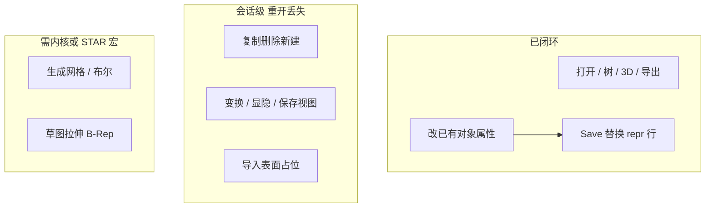

# 查看器 + 编辑器：完整度复盘与下一阶段规划（F 波）

> 对照基准：Siemens STAR-CCM+ 20.02（菜单权威源 `mf-layer.xml`）。求解运算仍排除。
> 依据：E0–E8 落地后的代码审计（`star_gui.py` / `sim_writer.py` / `star_gui_document.py`），
> 不是 `star_gui_parity.md` 的乐观口径。
> 评分：外壳=菜单是否存在；深度=能否改数据并在重开后仍在。

## 1. 结论（先看这个）

E0–E8 把客户端**外壳和会话骨架**搭齐了：命令总线、脏标记、属性就地编辑、树/3D 右键、
Save 能改**已有对象图行**。作为查看器，从「打开-浏览-看图」的约一半，提高到大约 **65%**。
作为编辑器，从接近 0 提高到大约 **18%**——真正闭环的只有「改已落盘对象的标量/列表字段」。

最大瓶颈仍不是缺按钮，而是三层能力没打通：

1. **写入器不能插入新对象、不能改数组/状态表** → 复制/新建/导入在重开后消失。
2. **会话改动不重建 3D 标签** → 新场景/显示器/Representation 只改树，视口仍是旧的。
3. **几何工具没碰网格数据** → 导入 STL 不读文件；变换只改 VTK actor。

## 2. 分项完整度与深度

口径：相对官方「打开-浏览-看图-改-存」；求解组不计分。括号内为相对 E0 前的变化。

| 域 | 外壳 | 深度 | 现状（审计） | 相对官方 |
| --- | --- | --- | --- | --- |
| 文件打开/关闭/最近/导出 | 齐 | 实 | Open/Close/STL/摘要/报告真实 | ~45%（+15） |
| 保存/另存为/重载 | 齐 | 窄 | 只替换 `line>=0` 的对象行；`created` 参数未插入；Reload **不提示脏** | persist ~20% |
| 新建/模板/宏/全部保存 | 有/灰 | 0 | New 只关文件；Save All `_nyi` | 0% |
| 导入 CAD/表面/体网格 | 齐 | 假 | `import_surface_from_path` **不读 STL**，克隆 MeshPart 改名 | ~5% |
| 编辑 Undo/复制删除重命名 | 齐 | 会话 | CommandBus 真实；复制体 `line=-1` 不落盘 | session 70% / persist 15% |
| 属性编辑 | 齐 | 会话→可存 | bool/数/色/矢量可改；引用/字典只读；颜色/透明刷新 3D | ~40% |
| 仿真树 | 齐 | 只读列出 | 已有 Operations / Derived Parts / 3D-CAD | ~55% |
| 树右键 | 齐 | 混 | 改名/复制走命令；勾选显隐**绕过**总线；网格执行是 NYI | ~25% |
| 3D 视口 | 齐 | 查看为主 | 场景分画、拾取、STAR 键位、RMB 视图/表示真实；框选缩放/测距是日志 | ~60% |
| 场景/显示器编辑 | 齐 | 会话假 | 新建场景不 `_build_3d`；Representation 只翻 `Mesh` 布尔 | ~20% |
| 变换/指定区域 | 齐 | 会话 | actor 变换；Keys 可补丁（已有 PartGroup 才能存） | session 40% / persist 10% |
| 网格菜单 | 齐 | 诊断可读 | 生成/清除/2D/修复 = `_kernel_nyi`；缩放=actor | ~10% |
| 3D-CAD | 外壳 | 0 | 工具栏显隐 + 树文件夹 | ~5% |
| 绘图/报告 | 标签 | 文本 | 对象图 Value 字段，无曲线、无解场着色 | ~10% |
| 求解/连接 | 灰显 | 正确禁用 | 测试锁定 `setEnabled(False)` | 不计 |

**合计**：查看器 **~65%**；编辑器 **~18%**（其中可重开复现的约 **8%**：已有对象的名称/颜色/透明/Keys）。

`star_gui_parity.md` 把导入表面、变换、新建显示器标成 session/persist，**偏乐观**。以本文件为准。

## 3. 已闭环 vs 未闭环（按数据路径）

### 已闭环

- `SimFile` 打开 21 文件语料；用户树与官方 Manager.Keys 同源。
- Geometry Scene（CAD 三角化）与 Mesh Scene（Remesh）分画；直升机回归锁定。
- 属性 → `SetPropertyCommand` → `obj.dict` + `patches` → Save 重写该对象整行 → 重开可见（已测 `PresentationName`）。
- 导出全局面网格 STL / 摘要 / semantic_report。
- 网格诊断：`extract_mesh()` 自洽标志。

### 会话级（Undo 有效，Save 无效或半有效）

- `duplicate_object` / `create_session_object`：`SimObject(..., line=-1)`，写入器直接 `continue`。
- `document.transforms`、`visibility`、`saved_views`：不进 patches。
- 树勾选显隐：`on_part_visibility` 直接改 actor，不进 CommandBus。
- 新 Scene / Displayer：树刷新，**不重建图形标签**。

### 外壳 / 禁用（保持诚实）

- 生成表面/体网格、清除、转 2D、布尔、体网格导入、草图/拉伸：`needs_kernel`。
- 找到 `starccmw.exe` 也**不启动宏**（避免改原文件）。

## 4. 架构债（不做会拖死后面每一波）

1. **写入器只做行替换**（`sim_writer.apply_patches_to_blob`）。新对象必须能：分配稳定 id、追加 repr 行、改 Manager.Keys、（可选）补 ClassVersions。否则复制/导入永远是演示。
2. **数组/状态表只读**。变换、真实 STL 导入、边界面片都卡在这里。第一档只写已有 Float8 顶点块；新块/T 块单列。
3. **命令总线覆盖不全**。勾选、仅显示、高亮应变成 Command，否则 Undo 与 3D 不一致。
4. **视图与文档不同步**。任何 `created` / Representation / Parts.Keys 之后应 `_build_3d` 或增量改 actor。
5. **Reload 丢脏数据**。与关闭提示不对等。
6. **解析剩余缺口**（`function_gap_analysis.md`）：体网格、边界↔面、解场位置、T 块文法。这些限制标量着色和精确拾取，不挡名称/颜色保存。

## 5. 分期（F0–F8）

原则：先把「已有对象改了能存、新对象能存」做成真编辑器，再碰数组；内核级继续挂钩、不假装。

### F0 诚实化与加固（0.5 波，不扩功能） ✅

- Reload 脏提示；关闭/新建已有提示，对齐。
- 树勾选 → `VisibilityCommand`；`show_only` 可撤销。
- 新建场景/显示器/Representation 后重建或刷新 3D 标签。
- `star_gui_parity.md` 改成与审计一致（导入=占位，变换=actor）。
- `test_gui_editor` 的 `imported_wall.stl` 改为不依赖仓库外文件。
- 验收：`tests/run_all.py` + `self_test.py`；直升机场景不回退。

### F1 已有对象落盘闭环（编辑器门槛 1） ✅

第一批必须 Save As → 本查看器重开 +（有许可时）官方打开一致：

- `PresentationName` / `name`
- `Opacity` / `*Color*`
- Displayer `Mesh`、`Collector`/`Keys`（指定到区域）
- Scene `CurrentView`（把 `saved_views` 写入对象，不再只放内存）

做法：补丁仍走整行替换；加「改颜色 → Save As → SimFile 再读」回归。有 STAR 时用 `resave_sim.java` 做差分（只比对象行，不比数组）。

不做：新对象、数组。

### F2 对象图插入（编辑器门槛 2） ✅

`sim_writer` 在对象区**追加** repr 行，并回写被改过的 Manager `Keys`：

- 复制部件 / 删除（从 Keys 摘掉）/ 新建场景 / 添加显示器 可 Persist。
- 新对象获得 `line` 偏移，二次保存不再丢失。
- id 分配与官方「图序号+2」兼容；追加在 ClassVersions 之前。

风险：官方客户端对尾部 ClassVersions / 状态表校验敏感。先 Save As 副本验收，不覆盖教程原件。

### F3 表面几何真编辑（不依赖 CAD 内核） ✅

- **真读 STL** → 新 MeshPart + 顶点/面数组（优先改已有数组块；不够再评估追加 Array 分区）。
- 变换：写回 Float8 顶点（可撤销 = 备份数组切片），不再只 `SetUserTransform`。
- 指定到区域：F1 的 Keys 补丁 + 树/3D 立刻可见。
- 文件>导入 CAD：无 Parasolid 时走 STL/OBJ 三角化，输出窗写明限制。

验收：导入立方体 STL → Save As → 重开体积/面数一致。

### F4 场景与 Vis 做完（会话+能写的字段） ✅

- Parts 过滤器编辑器（勾选 Part/PartSurface → Keys）。
- Representation：Geometry vs Remesh 用已有 `representation_source_id`，改完重建该场景页。
- 框选缩放（VTK rubber band）；测距两点。
- 硬拷贝已有；保存/恢复视图走 F1 的 CurrentView。
- 无解场则标量着色保持禁用。

### F5 查看器加深（解析向）

- 边界 ↔ FaceTypes 精确高亮/拾取（直升机 Geometry 已有子集经验，推到 Boundary）。
- 按 Part / 按场景导出 STL，替代全局 `extract_mesh` 一份文件。
- 体网格：先抽单元表（若数组对得上）再画线框；对不上则禁用并写原因。

### F6 绘图与场（有数据才开）

- 从对象图 + 已识别数组重建监视器/残差曲线（无则保持文本表）。
- 标量着色：定位到解场数组或 .simh 后再做；本波不做求解器采样。

### F7 STAR 宏桥（可选，需本机许可）

- 「生成网格 / 执行操作」：写出临时宏 + `starccmw -batch`，工作副本上跑，完成后 Reload。
- 无 exe / 用户取消：保持现在的 `_kernel_nyi`。
- **禁止**对教程原 `.sim` 就地跑宏。

### F8 3D-CAD（仍标 needs_kernel）

- 保持模式外壳 + 三角化变换/显隐。
- 草图/拉伸/缝边不排进 F0–F5。B-Rep / T 块文法继续放解析课题，不绑 GUI 承诺。

## 6. 建议顺序与验收

**必做顺序**：F0 → F1 → F2。做完 F2 才称「能保存的编辑器」。  
**并行**：F4 可与 F1 后半重叠（不依赖插入）。F3 依赖 F2（新 Part 要能进图）。  
**可砍**：F6 / F7 / F8 任一波不影响前序验收。

每波：

- 更新 `star_gui_parity.md`（view / session / persist / disabled / needs_kernel）
- `python tests/run_all.py` 与 `self_test.py` 全绿
- `tests/test_mesh_index.py` 直升机 Geometry/Mesh 不回退
- F1 起：改颜色或名称 → Save As → 重开一致
- F2 起：复制部件 → Save As → 重开树里还在
- F3 起：STL 面数往返

## 7. 明确不做

- 求解 Run / Initialize / Clear Solution / 连接服务器。
- 纯 Python 体网格生成、Parasolid 布尔、完整 3D-CAD。
- 在未插入对象图之前，把导入/复制画成「已保存」。
- 改 `tests/test_gui_u1.py` / `u2` 已锁定的菜单名与工具栏名（文件/场景/File/Solve/View/Display）。
